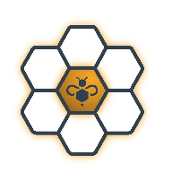

  

# Sourcebee

Sourcebee is a fast, SEO-ready developer tools platform built with a secure-by-default architecture.

Production domain: `https://sourcebee.org`

## Highlights

- 16 practical tools across encoding, data, security, and utility workflows.
- Next.js frontend with static SEO pages and metadata generation.
- FastAPI backend with strict validation, request limits, and rate limiting.
- Internal analytics service (MongoDB) that stores behavior metadata only.
- Docker Compose profiles for `dev` and `prod` environments.

## Tool Catalog

- JWT decoder
- Base64 encode/decode
- URL encoder/decoder
- JSON formatter/validator
- JSON ↔ YAML converter
- Hash generator
- UUID generator
- Timestamp converter
- Cron parser/generator
- Unit converter
- SSL certificate checker
- QR code generator
- Image converter
- PDF utilities (merge, split, compress)
- Secure password generator
- Hex/RGB color converter

## Tech Stack

- Frontend: Next.js App Router, TypeScript, Tailwind CSS
- Backend: FastAPI, Pydantic
- Analytics: FastAPI, MongoDB
- Shared state: Redis
- Orchestration: Docker Compose

## Privacy Model

- Sensitive inputs and generated outputs are not persisted.
- Uploaded files are processed transiently and discarded after response.
- Password/passphrase outputs are generated on demand and never stored.
- Behavior analytics metadata is collected (IP, route, tool slug, status, latency, user-agent, referrer).

## Run Locally

1. Start dev:
`docker compose --profile dev up --build -d`
2. Start prod profile locally:
`docker compose --profile prod up --build -d`
3. Start both:
`docker compose --profile dev --profile prod up --build -d`

Local endpoints:

- Dev frontend: `http://localhost:4000`
- Prod frontend profile: `http://localhost:4001`
- Dev analytics dashboard: `http://localhost:4100/dashboard`
- Prod analytics dashboard: `http://localhost:4101/dashboard`

Stop services:

- Dev only:
`docker compose stop frontend-dev backend-dev redis-dev analytics-dev mongodb-dev`
- Prod only:
`docker compose stop frontend-prod backend-prod redis-prod analytics-prod mongodb-prod`
- Full teardown:
`docker compose --profile dev --profile prod down`

Optional env override files:

- `cp frontend/.env.example frontend/.env`
- `cp backend/.env.example backend/.env`
- `cp analytics/.env.example analytics/.env`

## Project Structure

- `frontend/` Next.js app, SEO routes, UI
- `backend/` FastAPI tool APIs
- `analytics/` internal event ingest + dashboard
- `docs/` security, deployment, analytics, and SEO notes
- `infra/` optional infrastructure templates

## Security and Deployment Notes

For internet-facing deployment guidance, read:

- `docs/SECURITY.md`
- `docs/DEPLOYMENT.md`
- `docs/ANALYTICS.md`
